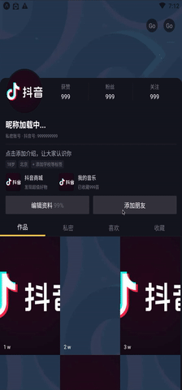

# react-native-scrollable-tabview

[](https://www.npmjs.com/package/@itenl/react-native-scrollable-tabview)

[English](./README.md) | 简体中文

基于纯 `JS` 脚本，不依赖原生，无需 `react-native link`，`Title` / `Header` / `Tabs` / `Sticky` / `Screen` 组件可灵活配置，其中 `Tabs` / `Sticky` 可在滑动到顶部时会进行吸顶；我们所支持的是以栈的形式独立管理自身的 `Sticky` / `Screen` / `Badge` / `tabLabel` 各项配置，并且为 `Screen` 注入[生命周期](#InjectionLifecycle) `onRefresh` / `onEndReached`它们将在下拉刷新与滚动条触底时触发，最后还为 `Screen` / `Sticky` 注入了更多 [props](#InjectionScreenProps)

##### Table of Contents
* [Example-API](https://github.com/itenl/react-native-scrollable-tabview-example-app)
* [Example-TikTok](https://github.com/itenl/react-native-scrollable-tabview-example-tiktok)
* [Features](#features)
* [Installation](#installation)
* [Usage](#usage)
* [Props](#props)
* [Method](#method)
* [Stack Property](#StackProperty)
* [Badge Property](#BadgeProperty)
* [Injection lifecycle to Screen](#InjectionLifecycle)
* [Injection props to Screen](#InjectionScreenProps)
* [Injection props to Sticky](#InjectionStickyProps)
* [Snapshot](#Snapshot)

## <a name="features"/>Features
* 支持为每个 `Screen` 设置下拉刷新与上滑加载更多(生命周期注入形式)
* Tabs 支持固定自适应与水平滚动两种配置方式
* 允许为每个 `Screen` 独立配置 `Sticky` 组件
* 允许为每个 `Tab` 独立配置自定义的徽章
* 支持下拉刷新与上滑加载更多前置函数 `onBeforeRefresh` / `onBeforeEndReached` 
* 支持动画标题，可支持动画为 `interpolate.opacity` 与 `interpolate.height`

## <a name="installation"/>Installation

```shell
npm i @itenl/react-native-scrollable-tabview
```
or
```shell
yarn add @itenl/react-native-scrollable-tabview
```

## <a name="usage"/>Usage

```jsx
import React from 'react';
import ScrollableTabView from '@itenl/react-native-scrollable-tabview';

function App() {
  return (
      <ScrollableTabView
        ref={rf => (this.scrollableTabView = rf)}
        mappingProps={{
          fromRootEst: this.state.est,
        }}
        badges={[
          null,
          [
            <View
              style={{
                position: 'absolute',
                zIndex: 100,
                top: 10,
                right: 0,
              }}
            >
              <Text>new</Text>
            </View>,
            <View
              style={{
                position: 'absolute',
                width: 150,
                height: 50,
                zIndex: 100,
                marginTop: 35,
                right: 0,
                opacity: 0.6,
                backgroundColor: 'pink',
                justifyContent: 'center',
                alignItems: 'center',
              }}
            >
              <Text>Three Tips</Text>
            </View>,
          ],
        ]}
        stacks={[
          {
            screen: One,
            sticky: Sticky,
            tabLabel: 'OneTab',
            tabLabelRender: tabLabel => {
              return `--- ${tabLabel} ---`;
            },
            badge: [<Text>one</Text>, <Text>two</Text>],
            toProps: {
              xx: 123,
            },
          },
        ]}
        tabsStyle={{}}
        tabWrapStyle={{}}
        tabInnerStyle={{}}
        tabActiveOpacity={0.6}
        tabStyle={{}}
        textStyle={{}}
        textActiveStyle={{}}
        tabUnderlineStyle={{}}
        firstIndex={0}
        syncToSticky={true}
        onEndReachedThreshold={0.1}
        onBeforeRefresh={(next, toggled) => {
          toggled();
          next();
        }}
        onBeforeEndReached={next => {
          next();
        }}
        onTabviewChanged={index => {
          alert(index);
        }}
        header={() => {
          return <View style={{ backgroundColor: 'pink', height: 120 }}></View>;
        }}
        oneTabHidden={true}
        enableCachePage={true}
        carouselProps={{}}
        sectionListProps={{}}
        toHeaderOnTab={true}
        toTabsOnTab={true}
        tabsShown={false}
        fixedTabs={false}
        fixedHeader={false}
        useScroll={false}
        fillScreen={true}
      ></ScrollableTabView>
  );
}
```

## <a name="props"/>Props

All props are optional

Prop              | Type     | Default     | Description
----------------- | -------- | ----------- | -----------
**`stacks`**            | Array    | []          | 页面栈 < [阅读 Stack Property](#StackProperty) >
**`mappingProps`**      | Object   | {}          | 关联映射数据到 Stack / Sticky
**`badges`**             | Array    | []          | 针对每个Tab的徽章 < [阅读 Badge Property](#BadgeProperty) >
**`tabsStyle`**             | Object    | {}          | 整个Tabs样式
**`tabWrapStyle`**             | Object / Function    | {}          | 单个Tab外包装样式 (函数参数提供了item, index, 需要返回样式对象，eg. **`return index == 1 && { zIndex : 10}`**)
**`tabInnerStyle`**             | Object    | {}          | 单个Tab内包装样式
**`tabActiveOpacity`**             | Number    | 0.6          | Tab按钮点击后透明度
**`tabStyle`**             | Object    | {}          | 单个Tab样式
**`textStyle`**             | Object    | {}          | Tab内文本样式
**`textActiveStyle`**             | Object    | {}          | 选中激活的text样式
**`tabUnderlineStyle`**             | Object    | {}          | 选中激活的下划线样式
**`firstIndex`**             | Number / Null    | null          | 设置 **`firstIndex`** 的栈为活动状态 (请在设定 **`firstIndex`** 值的时候确保 **`stacks`** 的个数大于 **`firstIndex`** )
**`syncToSticky`**             | Boolean    | true          | 是否同步(Screen中发生 **`render`** 触发 **`componentDidUpdate`** 将更新Sticky)
**`onEndReachedThreshold`**             | Number    | 0.2          | 触底回调阈值
**`onBeforeRefresh`**             | Function    | null          | 下拉刷新前置函数, 执行 **`next`** 将执行Screen中 **`onRefresh`** 函数，执行 **`toggled`** 将切换系统loading,可传 true / false 进行指定 (回调含有 **`next`** , **`toggled`** 两个形参)
**`onBeforeEndReached`**             | Function    | null          | 上滑加载更多前置函数, 执行next将执行Screen中 **`onEndReached`** 函数 (回调含有 **`next`** 形参)
**`onTabviewChanged`**             | Function    | null          | Tab切换完成回调 (回调含有 **`index`**, **`tabLabel`** 两个形参)
**`screenScrollThrottle`**             | Number    | 60          | **`Screen`** 横向滑动时节流参数,单位 (毫秒)
**`header`**             | Function / JSX Element / Class Component    | null          | 顶部组件 (若是函数需要返回 Element)
**`oneTabHidden`**             | Boolean    | false          | 仅一个Tab时将隐藏自身
**`enableCachePage`**             | Boolean    | true          | 是否持久化页面切换后不销毁
**`carouselProps`**             | Object    | {}          | 传递给 Carousel 的剩余属性 < [阅读 Carousel](https://github.com/meliorence/react-native-snap-carousel/blob/master/doc/PROPS_METHODS_AND_GETTERS.md) >
**`sectionListProps`**             | Object    | {}          | 传递给 SectionList 的剩余属性 < [阅读 SectionList](https://reactnative.dev/docs/sectionlist) >
**`toHeaderOnTab`**             | Boolean    | false          | 点击触发已激活的Tab将回到Header(高优先级)
**`toTabsOnTab`**             | Boolean    | false          | 点击触发已激活的Tab将回到Tabs
**`tabsShown`**             | Boolean    | true          | 配置 Tabs 显示隐藏
**`fixedTabs`**             | Boolean    | false          | 在 **`enableCachePage`** 为true的情况下滑动切换Screen设置最小高度保障Header与Tabs不会弹跳
**`fixedHeader`**             | Boolean    | false          | 与Tabs一同渲染，固定顶部Header，不跟随滚动
**`useScroll`**             | Boolean    | false          | Tabs是否支持横向滚动(存在多个类目Tab的情况需要启用，建议 **`tabStyle`** 传入固定宽度)
**`useScrollStyle`**             | Object    | {}          | 为滚动的 **`Tabs`** 设置 **`contentContainerStyle`**，常见为左右两侧添加边距 **`paddingLeft`** **`paddingHorizontal`**
**`fillScreen`**             | Boolean    | true          | 填充整个 Screen
**`title`**             | Function / JSX Element / Class Component    | null          | 动画标题
**`titleArgs`**             | Object    | **`{  style: {}, interpolateOpacity: {}, interpolateHeight: {} }`**          | 标题配置 < [阅读 interpolate](https://reactnative.dev/docs/animations#interpolation) >
**`onScroll`**             | Function    | null          | 滚动事件监听
**`tabsEnableAnimated`**             | Boolean    | false          | 为Tabs启用滑动效果，需要为 **`tabStyle`** 指定 **`width`**

## <a name="method"/>Method

``` javascript
  <ScrollableTabView
    ref={rf => (this.scrollableTabView = rf)}
  >
  </ScrollableTabView> 
  this.scrollableTabView.getCurrentRef();
  this.scrollableTabView.toTabView(1);
```

Name              | Type     | Description
----------------- | -------- | -----------
**`getCurrentRef(index: number.optional)`**            | Function   | 获取当前活动的视图的实例，可传 **`index`** 获取指定实例
**`toTabView(index: number.required / label: string.required)`**            | Function   | 跳到指定 Screen
**`scrollTo(index: number.required)`**            | Function   | 上下滑动至指定位置 (传入 0 默认定位至 tabs / 传入负数则置顶)

## <a name="StackProperty"/>Stack Property

Name              | Type     | Description
----------------- | -------- | -----------
**`screen`**            | Class Component   | Screen 类组件
**`sticky`**            | Class Component   | 吸顶类组件, 实例内将返回该类组件的上下文
**`tabLabel`**            | String   | Tab 昵称
**`tabLabelRender`**            | Function   | 自定义 Tab渲染函数，优先级高于 **`tabLabel`**
**`badge`**            | Array    | 针对当前 Tab 的徽章，与 **`badges`** 属性互斥，优先级高于最外层属性 **`badges`** < [阅读 Badge Property](#BadgeProperty) >
**`toProps`**            | Object    | **`toProps`** 仅传递给 Screen，不作数据关联

## <a name="BadgeProperty"/>Badge Property

Type     | Description
-------- | -----------
JSX Element   | 基于当前Tab进行渲染的 徽章 / 悬浮 Tips 等


##  <a name="InjectionLifecycle"/>Injection lifecycle to Screen

Name              | Type     | Description
----------------- | -------- | -----------
**`onRefresh`**            | Function   | 下拉刷新时触发,形参 **`toggled`** 函数用于切换原生 loading 状态的显隐，若在 loading 中用户切换 tab 将会强制隐藏并重置状态
**`onEndReached`**            | Function   | 上滑加载更多触发


##  <a name="InjectionScreenProps"/>Injection props to Screen

Name              | Type     | Description
----------------- | -------- | -----------
**`refresh()`**            | Function   | 手动触发刷新、同步Screen状态至Sticky
**`scrollTo(index: number.required)`**            | Function   | 上下滑动至指定位置 (传入 0 默认定位至 tabs / 传入负数则置顶)
**`toTabView(index: number.required / label: string.required)`**            | Function   | 跳到指定 Screen
**`layoutHeight.container`**            | Number   | Container 容器总高度
**`layoutHeight.header`**            | Number   | Header 高度
**`layoutHeight.tabs`**            | Number   | Tabs 高度
**`layoutHeight.screen`**            | Number   | 视图 高度

##  <a name="InjectionStickyProps"/>Injection props to Sticky

Name              | Type     | Description
----------------- | -------- | -----------
**`screenContext`**            | Object   | 获取 Screen 上下文


## <a name="Snapshot"/>Snapshot



<br />

---

**MIT Licensed**
