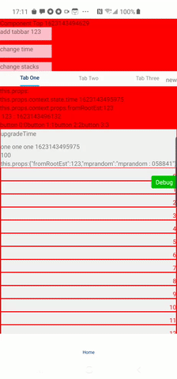

# react-native-scrollable-tabview

[](https://www.npmjs.com/package/@itenl/react-native-scrollable-tabview)

Based on pure JS scripts without native dependencies, the components of Header / TabBar / Sticky / View can be flexibly configured. Header / View can be slid according to TabBar. 
When TabBar and Sticky reach a certain position, they will be attached to the top.

##### Table of Contents
* [Features](#features)
* [Installation](#installation)
* [Usage](#usage)
* [Props](#props)
* [Stack Property](#StackProperty)
* [Badge Property](#BadgeProperty)
* [Injection lifecycle to screen](#InjectionLifecycle)
* [Injection props to Screen](#InjectionScreenProps)
* [Injection props to Sticky](#InjectionStickyProps)
* [Snapshot](#Snapshot)

## <a name="features"/>Features
* Support to individually set pull-down refresh and up-slide load for each screen (life cycle injection form)
* Flex Tabs and multiple Tabs horizontal scrolling support configuration method
* Allow to set up each Screen’s own Sticky component
* Custom badges can be configured for each Tab
* Support pull down to refresh and slide up to load more pre-functions

## <a name="installation"/>Installation

```shell
npm i @itenl/react-native-scrollable-tabview
```
or
```shell
yarn add @itenl/react-native-scrollable-tabview
```

## <a name="usage"/>Usage

```jsx
import React from 'react';
import ScrollableTabView from '@itenl/react-native-scrollable-tabview';

function App() {
  return (
      <ScrollableTabView
        ref={rf => (this.scrollableTabView = rf)}
        mappingProps={{
          fromRootEst: this.state.est,
        }}
        badges={[
          null,
          [
            <View
              style={{
                position: 'absolute',
                zIndex: 100,
                top: 10,
                right: 0,
              }}
            >
              <Text>new</Text>
            </View>,
            <View
              style={{
                position: 'absolute',
                width: 150,
                height: 50,
                zIndex: 100,
                marginTop: 35,
                right: 0,
                opacity: 0.6,
                backgroundColor: 'pink',
                justifyContent: 'center',
                alignItems: 'center',
              }}
            >
              <Text>Three Tips</Text>
            </View>,
          ],
        ]}
        stacks={[
          {
            screen: One,
            sticky: Sticky,
            tabLabel: 'OneTab',
            tabLabelRender: tabLabel => {
              return `--- ${tabLabel} ---`;
            },
            badge: [<Text>one</Text>, <Text>two</Text>],
            toProps: {
              xx: 123,
            },
          },
        ]}
        tabsStyle={{}}
        tabWrapStyle={{}}
        tabStyle={{}}
        textStyle={{}}
        textActiveStyle={{}}
        tabUnderlineStyle={{}}
        firstIndex={0}
        syncToSticky={true}
        onEndReachedThreshold={0.1}
        onBeforeRefresh={(next, toggled) => {
          toggled();
          next();
        }}
        onBeforeEndReached={next => {
          next();
        }}
        onTabviewChanged={index => {
          alert(index);
        }}
        header={() => {
          return <View style={{ backgroundColor: 'pink', height: 120 }}></View>;
        }}
        oneTabHidden={true}
        enableCachePage={true}
        carouselProps={{}}
        sectionListProps={{}}
        toHeaderOnTab={true}
        toTabsOnTab={true}
        tabsShown={false}
        fixedTabs={false}
        fixedHeader={false}
        useScroll={false}
        fillScreen={true}
      ></ScrollableTabView>
  );
}
```

## <a name="props"/>Props

All props are optional

Prop              | Type     | Default     | Description
----------------- | -------- | ----------- | -----------
stacks            | Array    | []          | 页面栈 < 阅读 [Stack Property](#StackProperty) >
mappingProps      | Object   | {}          | 关联映射数据到 Stack / Sticky
badges            | Array    | []          | 针对每个Tab的徽章 < 阅读 [badge](#BadgeProperty) >
tabsStyle            | Object    | {}          | 整个Tabs样式
tabWrapStyle            | Object    | []          | 单个Tab包装样式
tabStyle            | Object    | {}          | 单个Tab样式
textStyle            | Object    | {}          | Tab内文本样式
textActiveStyle            | Object    | {}          | 选中激活的text样式
tabUnderlineStyle            | Object    | {}          | 选中激活的下划线样式
firstIndex            | Number    | 0          | 默认选中index
syncToSticky            | Boolean    | true          | 是否同步(Screen中发生render触发componentDidUpdate将更新Sticky)
onEndReachedThreshold            | Number    | 0.2          | 触底回调阈值
onBeforeRefresh            | Function    | null          | 下拉刷新前置函数, 执行next将执行Screen中onRefresh函数，执行toggled将切换系统loading,可传 true / false 进行指定 (回调含有next, toggled两个形参)
onBeforeEndReached            | Function    | null          | 上滑加载更多前置函数, 执行next将执行Screen中onEndReached函数 (回调含有next形参)
onTabviewChanged            | Function    | null          | Tab切换完成回调 (回调含有index, tabLabel两个形参)
header            | Function    | null          | 顶部组件 (函数内需要返回 Element)
oneTabHidden            | Boolean    | false          | 仅一个Tab时将隐藏自身
enableCachePage            | Boolean    | true          | 是否持久化页面切换后不销毁
carouselProps            | Object    | {}          | 传递给 Carousel 的剩余属性 (https://github.com/meliorence/react-native-snap-carousel/blob/master/doc/PROPS_METHODS_AND_GETTERS.md)
sectionListProps            | Object    | {}          | 传递给 SectionList 的剩余属性
toHeaderOnTab            | Boolean    | false          | 触发已激活的Tab将回到Header(高优先级)
toTabsOnTab            | Boolean    | false          | 触发已激活的Tab将回到Tabs
tabsShown            | Boolean    | true          | 配置 Tabs 显示隐藏
fixedTabs            | Boolean    | false          | 在enableCachePage为true的情况下滑动切换Screen设置最小高度保障Header与Tabs不会弹跳
fixedHeader            | Boolean    | false          | 与Tabs一同渲染，固定顶部Header，不跟随滚动
useScroll            | Boolean    | false          | Tabs是否支持横向滚动(存在多个类目Tab的情况需要启用，建议 tabStyle 传入固定宽度)
fillScreen            | Boolean    | true          | 填充整个屏幕

## <a name="StackProperty"/>Stack Property

Name              | Type     | Description
----------------- | -------- | -----------
screen            | Class Component / Functional Component   | TabView 类组件 / 函数组件
sticky            | Class Component / Functional Component   | 吸顶 类组件 / 函数组件 实例内将返回该类组件的上下文
tabLabel            | String   | Tab 昵称
tabLabelRender            | Function   | 自定义 Tab渲染函数，优先级高于 tabLabel
badge            | Array    | 针对当前 Tab 的徽章，与 badges 属性互斥，优先级高于最外层属性 badges < 阅读 [badge](#BadgeProperty) >
toProps            | Object    | toProps 仅传递给 Screen，不作数据关联

## <a name="BadgeProperty"/>Badge Property

Type     | Description
-------- | -----------
JSX Element   | 基于当前Tab进行渲染的 徽章 / 悬浮 Tips 等


##  <a name="InjectionLifecycle"/>Injection lifecycle to screen

Name              | Type     | Description
----------------- | -------- | -----------
onRefresh            | Function   | 下拉刷新时触发,形参 toggled 函数用于切换原生 loading 状态的显隐，若在 loading 中用户切换 tab 将会强制隐藏并重置状态
onEndReached            | Function   | 上滑加载更多触发


##  <a name="InjectionScreenProps"/>Injection props to Screen

Name              | Type     | Description
----------------- | -------- | -----------
refresh            | Function   | 手动触发刷新、同步Screen状态至Sticky
scrollTo            | Function   | 上下滑动至指定位置 (传入 0 默认定位至 tabs / 传入负数则置顶)
toTabView            | Function   | 跳转至其他 Tab (可传入 index 或 tabLabel)
layoutHeight.container            | Number   | container 容器总高度
layoutHeight.header            | Number   | Header 高度
layoutHeight.tabs            | Number   | Tabs 高度
layoutHeight.screen            | Number   | 视图 高度

##  <a name="InjectionStickyProps"/>Injection props to Sticky

Name              | Type     | Description
----------------- | -------- | -----------
screenContext            | Object   | 获取 Screen 上下文


## <a name="Snapshot"/>Snapshot


<br />

---

**MIT Licensed**